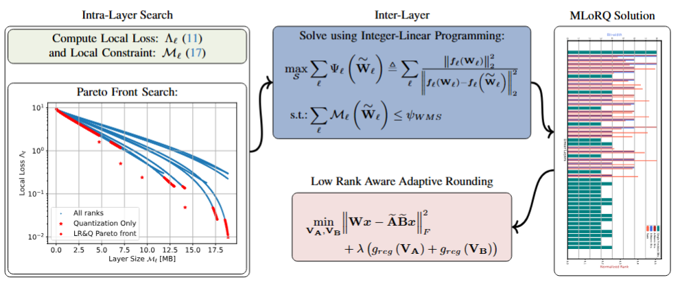

# MLoRQ: Bridging Low-Rank and Quantization for Effective Transformers Compression
PyTorch implementation of MLoRQ.
MLoRQ is a compression method for transformers-based networks.
It utilizes joint low-rank and quantization optimization for effective compression.

  

## Models

We provide a large set of pre-trained models to compress. 
The models are based on their implementation in the 
[timm](https://github.com/huggingface/pytorch-image-models).

The names of the available models can be found under [models_config.json](./models_config.json).
It includes the following models:

| Model      | Model usage name |
|------------|------------------|
| ViT-Small  | vit_s            |
| ViT-Base   | vit_b            |
| DeiT-Tiny  | deit_t           |
| Deit-Small | deit_s           |
| DeiT-Base  | deit_b           |
| Swin-Small | swin_s           |
| Swin-Base  | swin_b           |

## Setup

`pip install -r requirements.txt`

## Usage

### MLoRQ
`python main.py --model_name deit_s --weight_n_bits 3 --activation_n_bits 4 --train_data_path <path_to_training_dataset>  --val_data_path <path_to_validation_dataset>`

This example would execute MLoRQ to compress DieT-S with 3 bits for weights and 4 bits for activations.

### MLoRQ with Activation Mixed precision quantization
We also enable activation mixed precision quantization, in which different activations tensors can be quantized 
with other bit-width.

`python main.py --model_name deit_s --weight_n_bits 4 --activation_n_bits 4 --activation_mp --train_data_path <path_to_training_dataset>  --val_data_path <path_to_validation_dataset>`

This example would execute MLoRQ to compress DieT-S with 4 bits for weights and 4 bits for activations mixed precision.
